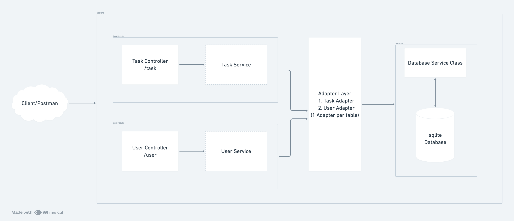

# task-manager-api

## Overview
This project is designed to serve as a backend API for managing tasks. It provides endpoints to create, read, update, and delete tasks, as well as assign people to tasks.

## Technology Stack
- TypeScript: A superset of JavaScript that adds static types, enhancing code quality and maintainability.
- NestJS – Scalable, modular backend framework for Node.js.
- Prisma: A modern database toolkit that simplifies database access and management.
- Database - SQLite: A lightweight, disk-based database that doesn't require a separate server process.
- Zod – Type-safe schema validation for inputs and queries (due to its huge popularity and ease of use).
- Prettier & ESLint: Code formatting and linting tools to maintain code quality and consistency.

## Assumptions
- The API is inspired by JIRA-like task management systems.
- Users must be created before they can be assigned to tasks.
- Each user must have a unique email address.
- Tasks can be created without being assigned to any user.
- By default, tasks are created with a “todo” status.
- A task can be assigned to only one user at a time.
- Multiple tasks can be assigned to the same user.
- Multiple tasks/users can exist in the system.
- Task status can be updated to reflect its progress (e.g., “in_progress”, “completed”).
- Time stamps for task creation and updates are recorded in UTC.
- Task deletion is permanent and cannot be undone.

## Installation & Setup
1. Clone the repository:

2. Install dependencies
   - `npm install`

3. Configure environment variables (.env.example file is provided for reference)
   - Create a `.env` file in the project root with:
     - DATABASE_URL="file:./dev.db"

## Run
- Dev mode (watch): `npm run start:dev`
- Prod build + run: `npm run build && npm run start`

The server listens on http://localhost:3000 & api is available to consume

For simplicity, a few example requests are included in the `API.http` file & could be run directly using the VS-Code REST Client extension.

Request example:
- GET /task
```bash
http://localhost:3000/task
```

Response example:
```json

[
    {
        "id": 1,
        "title": "Sample Task",
        "description": "This is a sample task description.",
        "status": "pending",
        "created_at": "2024-06-01T12:00:00.000Z",
        "updated_at": "2024-06-01T12:00:00.000Z",
        "user_id": 1
    }
]
```

- POST /task
```bash
http://localhost:3000/task
```
Request Body:
```json
{
    "title": "New Task",
    "description": "Description of the new task",
    "user_id": 1 // Optional
}
```
Response example:
```json
{
    "id": 2,
    "title": "New Task",
    "description": "Description of the new task",
    "status": "todo",
    "user_id": 1
}
```

- PATCH /task/:id
```bash
http://localhost:3000/task/2
```

Request Body:
```json
{
    "title": "Updated Task",
    "description": "Description of the updated task",
    "status": "in_progress"
}
```

Response example:
```json
{
    "id": 2,
    "title": "Updated Task",
    "description": "Description of the updated task",
    "status": "in_progress",
    "created_at": "2024-06-01T12:00:00.000Z",
    "updated_at": "2024-06-01T12:00:00.000Z",
    "user_id": 1
}
```

- DELETE /task/:id
```bash
http://localhost:3000/task/2
```
Response example:
```json
{
    "message": "Task with ID: 2 deleted successfully."
}
```

- POST /user
```bash
http://localhost:3000/user
```

Request Body:
```json
{
    "name": "John Doe",
    "email": "john.doe@example.com"
}
```
Response example:
```json
{
    "id": 1,
    "name": "John Doe",
    "email": "john.doe@example.com"
}
```

- PATCH /:id/assign
```bash
http://localhost:3000/task/1/assign
```
Request Body:
```json
{
    "user_id": 1
}
```
Response example:
```json
{
    "id": 1,
    "title": "Sample Task",
    "description": "This is a sample task description.",
    "status": "pending",
    "created_at": "2024-06-01T12:00:00.000Z",
    "updated_at": "2024-06-01T12:00:00.000Z",
    "user_id": 1
}
```

## Test
- Run Unit tests:
```bash
npm run test
```

- Run test coverage:
```bash
npm run test:cov
```

# Architecture
### Overview

- Database layer using Prisma ORM interacts with SQLite database
- Adapter layer to abstract database operations & provide clean interfaces per table (e.g. TaskAdapter, UserAdapter)
- Service layer uses Adapters to implement business logic (e.g. TaskService)



## Architectural Decisions

- Layered Architecture: The system follows a clear separation of concerns — Controller → Service → Adapter — ensuring maintainability, scalability, and ease of testing.  
- Adapter Pattern: The `TaskAdapter` & `UserAdapter` encapsulates all task-specific persistence logic. This abstraction prevents repetitive database operations across models, promotes code reuse, and decouples business logic from data access, enabling easier ORM or database migrations in the future.  
- Schema-First Validation: `ZodValidationPipe` enforces strict runtime validation at the boundary layer. Internally, camelCase is used for code consistency, while snake_case is applied for API communication and database interactions.

## Project Structure
```
src/
├── task/                                # Task Module
│   ├── task.controller.ts               # Controller for task endpoints
│   ├── task.service.ts                  # Service for task-related logic
│   └── task.module.ts                   # Task module definition
│
├── user/                                # User Module
│   ├── user.controller.ts               # Controller for User-related endpoints
│   ├── user.service.ts                  # Service for User-related logic
│   └── user.module.ts                   # User module definition
│
├── middleware/                          # Middlewares
│   └── logging.middleware.ts            # Logging middleware
│
├── adapters/                            # Adapter Module
│   ├── task.adapter.ts                  # Adapter for task-related database operations
│   ├── user.adapter.ts                  # Adapter for user-related database operations
│   └── adapter.module.ts                # Adapter module definition
│
├── database/                            # Database Module
│   ├── database.service.ts              # Database service for Prisma client
│   └── database.module.ts               # Database module definition
│
├── utils/                               # Shared utilities
│   └── validation.pipe.ts               # Validation pipe for request query parameters
│
├── prisma/
│   ├── schema.prisma                    # Prisma schema file
└── migrations/                          # Database migrations files
```


## Potential Improvements

### Performance & Scalability
- Implement caching for GET endpoints to improve response times.
- Add pagination to “Get all tasks” endpoints to efficiently handle large datasets.
- Apply rate limiting based on public IP to prevent API abuse and enhance security.

### Deployment & DevOps
- Dockerize the project for consistent environments and easier deployment.
- Set up a CI/CD pipeline for automated testing, linting, and deployment.

### Code Quality & Maintainability
- Implement centralized error handling for consistent error responses.
- Add centralized response formatting to maintain uniform API response structure.
- Introduce centralized Prisma error handling to manage database-related issues consistently.
- Add more unit and end-to-end (E2E) tests to validate the complete application flow across modules.

Documentation & Observability
- Integrate Swagger (OpenAPI) for API documentation.
- Optionally, add metrics & traces (OTEL) for better monitoring and debugging.